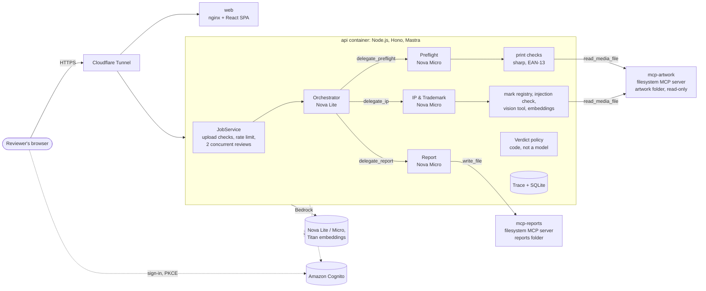

# Prepress Review Agents

A multi-agent system that reviews print artwork before it goes to press. A reviewer uploads an image (200 KB or less) with a short job ticket, and the system returns **APPROVE**, **REJECT** or **NEEDS_HUMAN_REVIEW** with a written report.

- An **orchestrator agent** plans the review and delegates to specialist sub-agents.
- A **Preflight agent** checks print-readiness: resolution, bleed, colour space and barcode check digit.
- An **IP & Trademark agent** flags protected brand names, slogans and logos (for example Nike or Adidas) as not OK to produce.
- A **Report agent** writes the result to disk through an external MCP server.

## Repositories

This project is developed in one local repository and pushed to two remotes with identical history:

| Remote | Visibility | Purpose |
|---|---|---|
| [GitHub: mushirkhan/prepress-review-agents](https://github.com/mushirkhan/prepress-review-agents) | Public | **For the examiner.** Review the code and the commit history, which shows how the system was built step by step. |
| GitLab: genai-rag/prepress-review-agents | Private | CI/CD only. The pipeline runs on a self-hosted GitLab group runner on the author's Proxmox server, builds the Docker images and deploys them to a dedicated VM published at `prepress.gemsofy.com` through Cloudflare Tunnel. |

`.gitlab-ci.yml` is included so the pipeline can be reviewed, but it only runs on GitLab. GitHub Actions runs lint, tests and a secret scan on every push.

## Contributing safely

The GitHub repository is public, so a gitleaks pre-commit hook blocks commits that contain anything that looks like a key or token. Enable it once per clone:

```bash
brew install gitleaks              # macOS; see gitleaks docs for other platforms
git config core.hooksPath .githooks
```

GitHub Actions repeats the scan on every push as a backstop.

## Architecture



Five containers run on one VM: `cloudflared`, `web`, `api` and two instances of the external MCP filesystem server. Only `cloudflared` has a route in from the internet; the MCP servers sit on an internal network with no internet access.

**One review, end to end**

1. The browser uploads the artwork and a job ticket. The API checks the file by content (type, size, decodability) **before any model runs**, stores it, and returns a job id (`202`).
2. The review runs in the background. The orchestrator gets the ticket and delegates. Each delegation tool rebuilds the specialist's brief from the ticket and applies the delegation guardrails.
3. Preflight and IP & Trademark call their tools. The tools read the artwork through the `mcp-artwork` MCP server (one shared read per job), measure or match deterministically, and record structured issues.
4. Code turns the issues into the verdict. The Report agent explains it and saves the report through the `mcp-reports` MCP server; if it fails, a template report is written instead.
5. Every step is written to the job's trace. The browser follows it live over Server-Sent Events, which is what the timeline on the job page shows.

**Key decisions**

| Decision | Why | Trade-off |
|---|---|---|
| The verdict is decided by code from structured issues, not by a model | A model cannot be talked out of a finding, and the result is testable and repeatable | The policy is simple (worst severity wins); nuance goes to a human via `NEEDS_HUMAN_REVIEW` |
| Measurements and matching are deterministic tools; models choose, read and explain | Cheap models are good at reading text and explaining; they are poor at arithmetic on pixels | More tool code to write and maintain |
| Orchestrator plus three specialists with disjoint tools | Each agent has a small prompt and a small toolset, which keeps cheap models on task and makes scope enforceable | More model calls per review than one agent with every tool |
| Own delegation tools (`{ task }`) instead of Mastra's built-in sub-agent tools | Nova Lite produced malformed tool calls with the built-in schema; one string field is reliable | Slightly more code |
| Nova Lite for the orchestrator and vision, Nova Micro for specialists, greedy decoding | Lowest-cost Bedrock models that handled the task; temperature 0 and top-k 1 make runs repeatable | Less capable than larger models on messy real artwork |
| Files only through an external MCP server, two instances with one folder each | Shows a real external MCP integration, and gives three independent limits (client allowlist, server root, read-only mount) | An extra hop and two more containers |
| Fail closed | A broken run must never look like an approval | Outages send work to humans |
| Mastra on Node.js, SQLite, one VM | Fits the 3–4 hour scope and the home server; everything self-hosted except Bedrock and Cognito | Single instance; see [Taking this to production](#taking-this-to-production) |

## How responsibilities are divided between agents

| Agent | Model | Responsibility | Tools | Cannot |
|---|---|---|---|---|
| **Orchestrator** | Nova Lite | Plans the review and delegates; proposes a verdict | `delegate_preflight`, `delegate_ip`, `delegate_report` (delegation only) | See the artwork, run checks, write files |
| **Preflight** | Nova Micro | Print-readiness: resolution, bleed, colour space, barcode | `read_image_metadata`, `check_image_dpi`, `check_bleed`, `check_color_space`, `validate_barcode` | Judge brands, decide the verdict, write |
| **IP & Trademark** | Nova Micro (+ Nova Lite vision inside one tool) | Protected brands, slogans, logos; manipulation attempts | `inspect_artwork_image`, `match_protected_marks`, `search_mark_descriptions`, `detect_injection` | Check print quality, decide the verdict, write |
| **Report** | Nova Micro | Writes the report for the customer | `save_report` (the only write in the system) | Change the verdict or findings |

The agents are built with [Mastra](https://mastra.ai) (agents, tools and the tool-calling loop). Delegation uses three explicit tools with a one-field input (`{ task }`) rather than Mastra's built-in sub-agent tools: their input schema has many optional and multi-type fields, and Nova Lite produced malformed tool calls with it in live testing.

**How work is delegated.** The orchestrator delegates to Preflight and IP & Trademark, then to Report. Every delegation tool applies the same guardrails before running the specialist:

- rebuilds the specialist's brief from the job ticket, so the orchestrator's wording cannot change what is checked;
- blocks the Report agent until both checks have finished;
- stops repeat delegations to an agent that already finished, and caps attempts and steps per agent.

**How information flows.** Tools read the job's file from the run's context, never from a path chosen by a model. Each tool returns a small result for the model to reason about and records structured `Issue`s for the system. The verdict is computed by code from those issues (`decideVerdict`): any `CRITICAL` → **REJECT**, any `WARNING` → **NEEDS_HUMAN_REVIEW**, otherwise **APPROVE**. A required check that did not run becomes `CHECK_INCOMPLETE` (a warning), so a model cannot produce a pass by skipping work. The Report agent receives the policy's verdict and the findings, and the system writes the verdict line into the saved report itself.

**Why models at all?** Models decide which checks to run, read the text on the image, judge context ("apple" in "apple juice") and explain results in plain language. Measurements and the final decision are deterministic code, so they are testable, repeatable and cannot be talked out of a finding.

**Failure handling.** Tool errors come back to the agent as values; tools time out; vision output is schema-checked and retried once; Bedrock throttling is retried with backoff. If anything still fails, the review fails closed (never APPROVE) and a report is always written, from a template if the Report agent did not save one. Every step is recorded in a trace (delegations, tool calls, results, blocked calls, verdict) that drives the live timeline and the evaluation.

## Tools and the external MCP server

Agents act only through tools. The domain tools are plain, deterministic TypeScript functions: the model decides **when** to call them and explains the results, but never measures pixels or matches trademarks itself. That keeps the checks testable and repeatable.

| Tool | Used by | What it does |
|---|---|---|
| `readImageMetadata` | Preflight | Pixel size, declared DPI and colour space via `sharp`. Fully decodes the file, so empty, non-image and truncated files fail with a clear reason |
| `checkImageDpi` | Preflight | `LOW_RESOLUTION` below the ticket's minimum DPI |
| `checkBleed` | Preflight | File must measure trim + bleed (either orientation, 0.5 mm tolerance); exactly trim size is `BLEED_MISSING` |
| `checkColorSpace` | Preflight | RGB artwork on a CMYK job is `WRONG_COLOR_SPACE` |
| `validateEan13` | Preflight | Recomputes the barcode check digit |
| `matchProtectedMarks` | IP & Trademark | Brand names and slogans from a fixed registry; catches look-alikes (`N1KE`) and misspellings (`ADIDAZ`); everyday words such as "apple" are flagged as ambiguous, not rejected |
| `detectInjection` | IP & Trademark | Flags text on the artwork that tries to instruct the review system |

Every tool returns structured `Issue`s with a fixed code and a severity (`CRITICAL`, `WARNING`, `INFO`), so the verdict policy and the evaluation work on codes rather than free text.

### The external MCP server

Agents never touch the filesystem directly. They reach files only through **[`@modelcontextprotocol/server-filesystem`](https://github.com/modelcontextprotocol/servers/tree/main/src/filesystem)**, an MCP server maintained by the MCP project, using the official MCP TypeScript SDK client.

| Connection | Server sees | Mounted | Tools the server offers | Tools this client may call | Used by |
|---|---|---|---|---|---|
| `mcp-artwork` | artwork folder only | read-only | 14 (`read_media_file`, `write_file`, `move_file`, …) | `read_media_file` | Preflight and IP & Trademark tools |
| `mcp-reports` | reports folder only | read-write | 14 | `write_file` | Report agent's `save_report` |

Three independent layers keep the agents inside their scope:

1. **Client allowlist.** Each connection refuses any MCP tool outside its list before a request leaves the API.
2. **Server boundary.** Each server instance is started with one folder; anything outside it is refused by the server (`Access denied - path outside allowed directories`).
3. **Operating system.** The artwork folder is mounted read-only into its MCP container, so artwork cannot be modified even if both layers above failed.

File paths are built from a validated job id by the store, never by a model. Every MCP call appears in the trace under the agent whose tool made it. In production each server runs in its own container behind a small stdio-to-HTTP bridge on an internal network with no internet access; in local development and tests it is started over stdio.


## Sample artwork

[`samples/`](samples/README.md) holds 13 generated artwork files and 4 invalid uploads, each with a job ticket and an expected result in `samples/manifest.json`. They are generated from known inputs, so the expected results are ground truth by construction. Use them to try the app, and they double as the evaluation's golden set.

## Running the application

**Live:** [prepress.gemsofy.com](https://prepress.gemsofy.com) (sign-in with a Cognito account in the `prepress-reviewers` group). Pick a sample under **Try a sample**, start the review and watch the agents work.

### Locally

```bash
npm ci
AUTH_MODE=dev npm run dev -w @prepress/api     # API on http://localhost:3000, no sign-in (refused in production)
npm run dev -w @prepress/web                   # web app on http://localhost:5173, talking to the local API
```

Put the `prepress-app` IAM user's keys in a `.env` file at the repository root (see `.env.example`; it is git-ignored). Without AWS credentials the API still runs, and every review fails closed as `NEEDS_HUMAN_REVIEW`. Locally, the external MCP filesystem server is started over stdio automatically.

### API

All endpoints except `/healthz` need a Cognito access token issued to the `prepress-web` client for a user in the `prepress-reviewers` group.

| Method and path | What it does |
|---|---|
| `POST /jobs` | Upload artwork (`file`, 200 KB or less) and a JSON job ticket (`ticket`). Returns `202` with the job id; the review runs in the background. Invalid uploads are refused before any model runs: `400` empty, `413` too large, `415` not a JPEG/PNG/TIFF by content, `422` undecodable. |
| `GET /usage` | Your review allowance today: `limit`, `used`, `remaining`, `resetsAt` |
| `GET /jobs` | Your jobs, newest first |
| `GET /jobs/:id` | Status, verdict, issues per agent, agent summaries, boundary violations, token usage |
| `GET /jobs/:id/events` | **Live trace** (Server-Sent Events): every delegation, tool call, MCP call and guardrail decision as it happens; replays finished runs; resumes with `Last-Event-ID` |
| `GET /jobs/:id/report` | The Markdown report |
| `GET /jobs/:id/artwork` | A browser-friendly preview of the upload |
| `GET /samples`, `GET /samples/:id/file` | The sample set, for trying the app |

Each user can start **5 reviews per day** (the allowance resets at midnight UTC; refused uploads do not count), and at most 2 reviews run at once. Over the allowance, `POST /jobs` returns `429 DAILY_LIMIT_REACHED` with a `Retry-After` header, and the web app shows how many reviews are left and disables **Start review** when none are. Another user's job always returns `404`.

### Web app

A Vite + React single-page app served by nginx. **New review** uploads artwork with its job ticket or loads a sample; the **job page** shows the verdict, the agent timeline live as it happens (every delegation, tool call with its result, MCP call, refused delegation and blocked tool call), the findings grouped by agent and the report; **History** lists your reviews. Sign-in is Cognito's hosted page (authorization code with PKCE). The live timeline reads the API's Server-Sent Events with `fetch`, because `EventSource` cannot send the access token.

## Running the tests and evaluations

```bash
npm ci
npm run check                                  # lint, typecheck and all tests (offline, no AWS)
npm run review -w @prepress/api -- flyer-nike  # one live review against Bedrock (needs AWS credentials in .env)
```

The agent tests use a scripted model that plays back each agent's steps, so delegation, tool use, guardrails and failure handling are tested offline, for free and deterministically.

The live evaluation is described under [Evaluation approach](#evaluation-approach).

## Evaluation approach

The evaluation asks **"does the system behave correctly?"**, not "is the model clever?". It runs every sample through the whole system against real Bedrock and scores each run with plain code, from the result and the trace. The full reasoning is in [`apps/api/evals/README.md`](apps/api/evals/README.md); in short:

- **Ground truth by construction.** The samples are generated from known inputs, so the expected verdicts and issue codes are facts.
- **Outcome and behaviour.** Besides the verdict and issue codes (precision and recall), each run is checked for *how* it got there: every required check ran, no out-of-scope tool calls, correct delegation order, the Report agent wrote a report that covers the findings, one artwork read through MCP, and whether the orchestrator's own proposal matched the policy.
- **No LLM judge.** Every question here has an exact answer, so deterministic checks are cheaper, repeatable and cannot be talked round.
- **Asymmetric gates.** Approving infringing or unprintable artwork is the costly mistake, so **unsafe approvals must be zero**; boundary violations must be zero; verdict accuracy and check completion must be at least 90%.
- **Stability.** `--repeat N` reruns each sample and lists any whose verdict changed.
- **The evaluation is tested too.** Offline tests show it passes a correct system and fails a broken one (a blind vision model, an agent that skips its checks).

```bash
npm run eval -w @prepress/api -- --repeat 3 --publish   # writes apps/api/evals/RESULTS.md
```

`--publish` writes the summary to `apps/api/evals/RESULTS.md`, which is committed with each published run.

## Deployment (CI/CD)

```
push to main ──► GitLab: check ──► build_images ──► deploy ──► app VM (deploy.sh)
                 lint, typecheck,  api, web, MCP    SSH with a      pull, start,
                 offline tests     images tagged    restricted key  health check,
                                   with git SHA                     roll back on failure
```

- The pipeline runs on a self-hosted GitLab group runner (Docker executor) on the author's Proxmox server.
- `build_images` pushes the `api`, `web` and `mcp-filesystem` images to `registry.gitlab.com/genai-rag/prepress-review-agents/<image>:<short-sha>`.
- `deploy` connects with an SSH key that the VM restricts to running `/opt/prepress/deploy.sh`, so the key cannot open a shell. The compose file is sent on stdin and the image tag must be a git SHA.
- `deploy.sh` keeps the previous release and rolls back automatically if the API's `/healthz` and the web app do not both respond within 60 seconds.
- No ports are published on the VM. Public traffic reaches it only through Cloudflare Tunnel.

One-time VM setup (already done for the live environment): copy `infra/deploy.sh` to `/opt/prepress/deploy.sh` and create `/opt/prepress/.env` from `.env.example`.

## Assumptions and limitations

**Assumptions**

- Artwork input is a single JPEG, PNG or TIFF of 200 KB or less, as agreed for this exercise. At 300 DPI this covers small formats such as business cards, A6 flyers and labels.
- The job ticket is trusted input from the customer's order (trim size, bleed, colour mode, minimum DPI, barcode, licence reference). The artwork is untrusted.
- A brand on the artwork without a matching licence on the ticket is not OK to produce. Ambiguous everyday words that are also brands ("apple") go to a human rather than being rejected.
- Missing a problem is worse than asking a human, so the system leans towards `NEEDS_HUMAN_REVIEW` when unsure or when anything fails.

**Limitations**

- **Synthetic samples.** The 13 samples use clean fonts and flat colours. Real artwork (photos, small or rotated text, real logos) is harder for the vision step, and the evaluation does not yet measure that.
- **Small trademark registry.** A handful of brands, slogans and logo descriptions, enough to show the behaviour. It is not legal clearance.
- **Raster checks only.** No PDF, vector, font, ink coverage or spot colour checks; bleed is inferred from pixel dimensions.
- **Model variance.** Greedy decoding makes runs repeatable but not guaranteed identical across Bedrock model updates; the evaluation's `--repeat` reports any instability.
- **Single instance.** Reviews run inside the API process on one VM, with SQLite and local folders. A restart during a review fails that review (it is marked failed, never approved). At most 2 reviews run at once.
- **Home-server operations.** No high availability, backups are manual, and SSH to the VM uses password login from the home LAN only.
- **Live evaluation results.** The evaluation harness, gates and offline tests are complete; a published live run (`RESULTS.md`) is added when it is run against Bedrock.

## Taking this to production

The live deployment is a working demo on one home server. For real customers I would change the following, roughly in this order.

**Reliability and scale**

- **Queue and workers.** Today reviews run inside the API process, so a restart loses in-flight reviews. Put jobs on a queue (SQS) and run agents in separate worker processes or containers that scale with queue depth, with retries and a dead-letter queue. The API then only accepts uploads and serves results.
- **Managed storage.** Move artwork and reports to S3 (encrypted, lifecycle rules for retention) and jobs plus traces to Postgres (RDS). The MCP boundary stays: either the filesystem MCP server over a mounted volume, or an S3-backed MCP server with the same read-only/write-only split, enforced again by IAM policies per role.
- **Hosting.** Run the containers on ECS Fargate or EKS across two availability zones behind an ALB, with WAF in front; replace the home VM, the tunnel and SSH deploys with image deploys through the cloud provider (blue/green or canary, automatic rollback on health checks).
- **Bedrock limits.** Request quota increases, use cross-region inference profiles, add a circuit breaker and a per-customer budget, and keep the fail-closed behaviour when the model is unavailable.

**Quality of the reviews**

- **Real artwork.** Accept PDF/X and larger files (presigned S3 uploads), extract text, fonts, images and colour data from the PDF itself, and add checks that matter on press: total ink coverage, spot colours, overprint, font embedding, minimum line weights and text size.
- **Trademarks.** Replace the fixed registry with a maintained trademark source and a logo detection model, with licence records per customer so a licensed brand is approved for that customer only.
- **Evaluation as a release gate.** Grow the golden set from real, anonymised jobs, including every reviewer override; run the evaluation on every prompt, model or code change before deploy, and track accuracy and unsafe approvals over time. Add a production feedback loop: reviewers confirm or overturn verdicts, and disagreements become new test cases.
- **Human in the loop.** A review queue for `NEEDS_HUMAN_REVIEW` with assignment, comments and an audit of who approved what.

**Security and operations**

- **Secrets and identity.** IAM roles instead of access keys, secrets in Secrets Manager, least-privilege policies per service, and Cognito with MFA and per-customer tenancy (jobs partitioned by organisation, not only by user).
- **Uploads.** Malware scanning, strict decoding limits (pixel count, decompression bombs) and storage of the original file separately from anything the models see.
- **Prompt injection.** Keep the current layers (text on the artwork is data, tools have no write access, the verdict is code) and add red-team cases to the evaluation set.
- **Observability.** Export the trace as OpenTelemetry spans (one span per agent, tool and MCP call) to a tracing backend; dashboards and alerts for latency, error rate, token cost per review, guardrail blocks and verdict mix; structured logs with job ids, without customer content.
- **Compliance.** Data retention and deletion per customer, region pinning for artwork, and a documented model and data-processing inventory.
